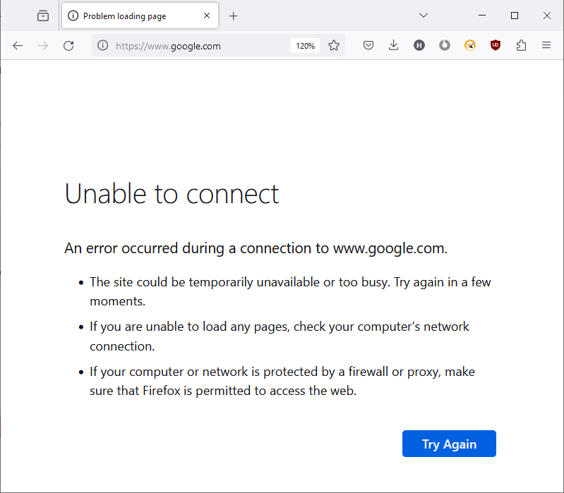

# Websites-Blocker-using-python-
The Website Blocker GUI is a user-friendly application built using the Tkinter library in Python. It allows users to easily block and unblock websites by modifying the system's hosts file. The program provides a clean and intuitive interface for users to interact with.

